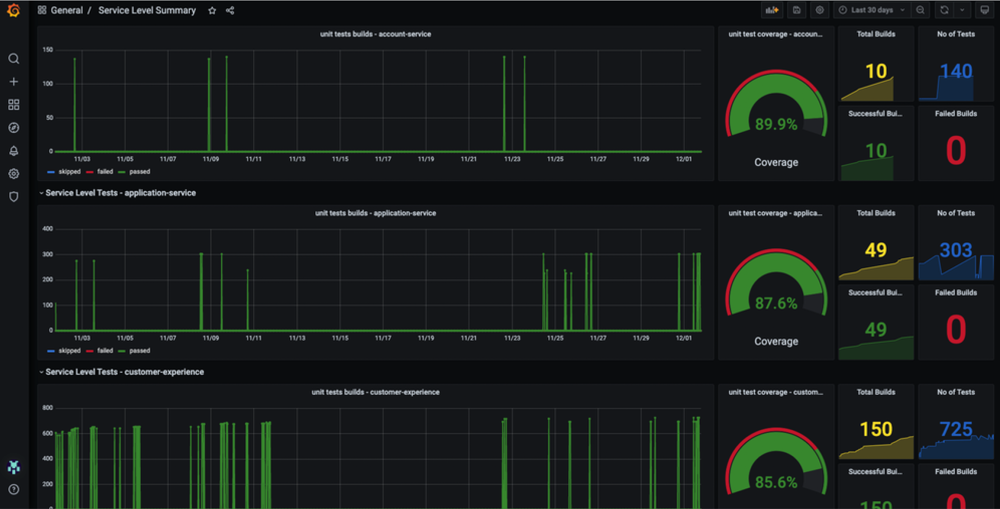
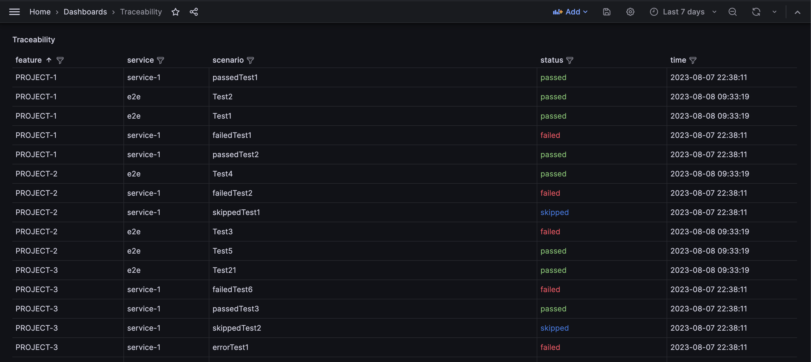
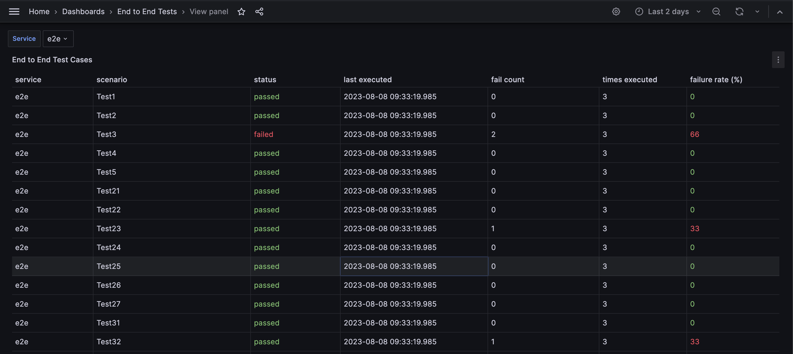
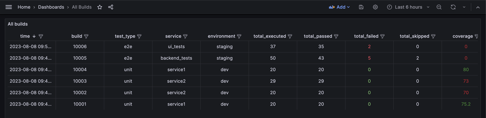

# TRECO

Treco a.k.a Test Report Collector is a simple tool which parses _junit_ formatted test reports and stores it in a database.  

As _junit_ report is a widely accepted format, reports from most of the testing frameworks can be pushed to treco.

## Running Treco
Treco can run as a service or as a command line tool.  
It is preferred to run it as a service so the report file can be sent to service over an http call

### Prerequisite
Treco is backed by Postgres DB, hence you will need an instance of PG running before Treco can be used.

### Running as a service
Treco service needs DB credentials to start. DB credentials are read from the `env` variables.   This gives flexbility to supply creds via secrets in K8s or from the Vault by mounting vault secrets onto the pod.

Make sure following `env` variables are provided, `DB_HOST`, `DB_PORT`, `DB_NAME`, `DB_USER`, `DB_PASSWORD` and `DB_TYPE`.   

Note: For now tool only supports Postgres DB, so `DB_TYPE` must be `postgres`. Tool is designed in such a way that it can be easily extended to use different databases

To start the service, run `./treco serve`

Environment variables can also be passed through a `.env` file. To read env from file start the treco with below command  
`./treco serve -c <path_to_env>`

```
./treco serve --help                                    
Runs as a web server

Usage:
  treco serve [flags]

Flags:
  -c, --config string   config file
  -h, --help            help for serve
  -p, --port int        port for server to run (default 8080)
  ```

### Sending report to the service 
Treco exposes a single endpoint `/v1/publish/report` which accepts `multipart/form-data` payload. Below is an example
```
curl --location 'http://localhost:8080/v1/publish/report' \
--form 'ci_job_id="12345"' \
--form 'environment="dev"' \
--form 'jira_project="Project"' \
--form 'service_name="service-1"' \
--form 'report_format="junit"' \
--form 'test_type="unit"' \
--form 'coverage="75.2"' \
--form 'report_file=@"/path/to/junit/xml/file"'
```

| Params | Description |
|---------|---------------|
|*ci_job_id*    | Job ID generated by the CI tool used           
|*environment*  | Environment of test execution  
|*jira_project* | Name of the Jira Project against which traceability needs to be captured  
|*service_name* | Name of the microservice for which tests were executed  
|*report_format*| Must be `junit` for now. Tool can be extended to support other report formats  
|*test_type*    | Must be one of `unit`, `contract`, `integration` or `e2e`
|*coverage*     | Sent of unit tests. Can be set to 0 for integration and end to end tests
|*report_file*  | Path of the actual junit report generated


### Running as a command line tool
You can also run Treco as a cmd line tool after the tests are executed to push report to treco.
Treco help command can provide all the arguments that needs to be passed via commandline
```
./treco collect --help                                  
config file Runs as a command line tool

Usage:
  treco collect [flags]

Flags:
  -b, --build string         CI Build name or number to uniquely identify the Build
  -c, --coverage string      statement level code coverage
  -e, --environment string   Environment on which the Build is executed
  -f, --format string        report of report file
  -h, --help                 help for collect
  -j, --jira string          Jira project name
  -r, --report string        input file containing test reports
  -s, --service string       Service name
  -t, --type string          type of tests executed. 'unit', 'contract', 'integration' or 'e2e
```

## Quick Setup
Below steps can help you to get the whole setup running under 5 mins

__Step 1: Start Postgres DB__  
`docker run --network test_network --name postgres -e POSTGRES_PASSWORD=secret -e POSTGRES_DB=treco -d postgres`

__Step 2: Start Grafana__  
`docker run -d -p 3000:3000 --network test_network --name=grafana --volume grafana-storage:/var/lib/grafana grafana/grafana-enterprise`

__Step 3: Configure Postgres DataStore in Grafana__  
With name `Postgres` and import all the dashboards from [Dashboards](./dashboards) folder.  
*Note:* Use the PG container's IP address to configure is Grafana as they would communicate ove the network.

__Step 4: Start the service__  
`./treco serve -c <path_to_env>`  

__Step 5: Send curl command to service__  
Send your 1st report to service by running curl command as shown [Here](#sending-report-to-the-service)

Now just refresh your dashboards and Voila! you can start visualising your data !!


## Dashboards
[Dashboards](./dashboards) folder has few sample dashboards which can help you get started into viewing some important insights from your test results. These are only few of the dashboards but there is no limit on the dashboards you can build once you have captured the relevant data.

### Service Level Summary
This dashboard is helpful to visualize unit test executions. It shows builds executed on a time series with current code coverage graph and test execution numbers



### Traceability
If your Junit report can have `Features` attribute embedded intp `<test>` tag, This will be captured as traceability. `Status` column is from the most recent execution of the test



### End to End Tests
Failure rate is high in these tests and capturing test falkiness is an important metric. This dashboard helps to capture that



### All Builds
All builds is just a simple table with filters on it to search for builds as required

